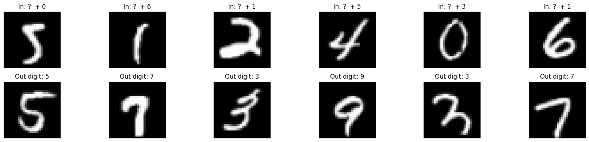
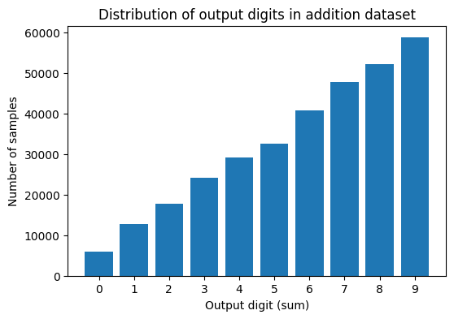
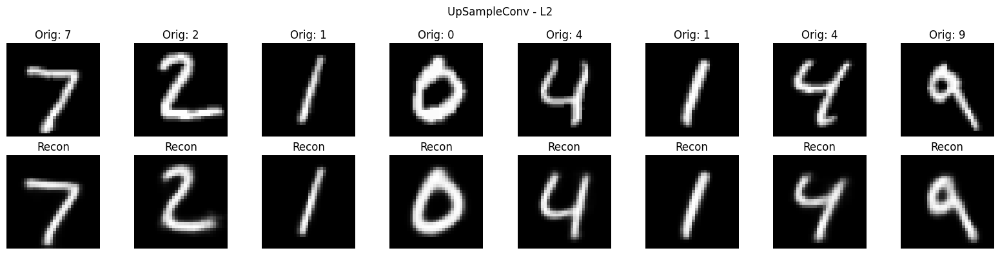
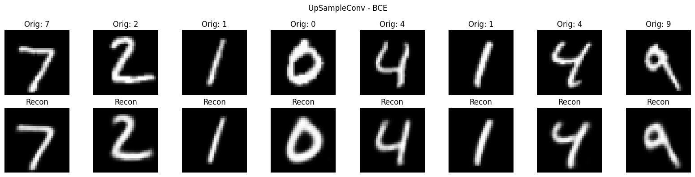
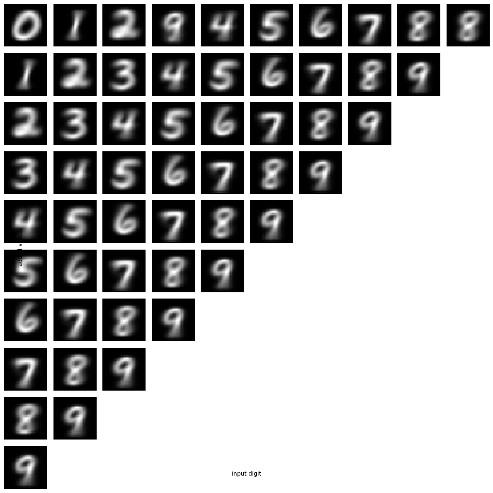
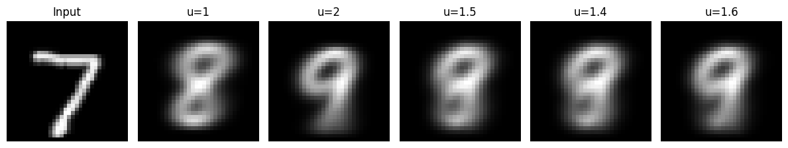
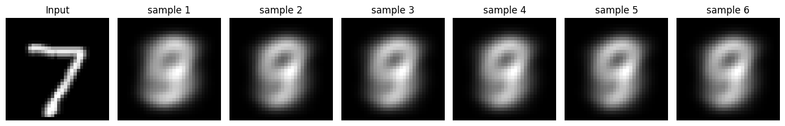

# Learning to Add and Generate MNIST Digits

[](https://www.python.org/)
[](https://pytorch.org/)
[](https://pytorch.org/vision/stable/generated/torchvision.datasets.MNIST.html)
[](#)

This project implements an end-to-end deep learning pipeline that learns to **understand handwritten digit images**, **perform arithmetic in latent space**, and **generate an MNIST-like image of the resulting digit**.

The core idea is to encode an input digit image into a compact latent representation, combine this representation with a scalar value to add, and decode the predicted latent code back into an image of the expected sum.

For example:

```text
(image of 3, add 2)  -> generated image of 5
(image of 7, add 1)  -> generated image of 8
(image of 7, add 2)  -> generated image of 9
```

The project also includes an optional generative extension using a **Variational Autoencoder (VAE)** and a **generative latent addition model**.

---

## Table of Contents

- [Project Overview](#project-overview)
- [Motivation](#motivation)
- [Dataset](#dataset)
- [Methodology](#methodology)
- [Model Architecture](#model-architecture)
- [Training Strategy](#training-strategy)
- [Results](#results)
- [Generated Examples](#generated-examples)
- [Repository Structure](#repository-structure)
- [Installation](#installation)
- [How to Run](#how-to-run)
- [Key Learnings](#key-learnings)
- [Limitations and Future Work](#limitations-and-future-work)
- [Author](#author)

---

## Project Overview

This work is based on a representation learning and generative modeling mini-project. The objective is not only to classify digits, but to build a model that can manipulate digit semantics through a learned latent space.

The final system contains three main components:

| Component | Symbol | Role |
|---|---:|---|
| Encoder | `E(θ)` | Maps an MNIST image into a latent vector |
| Addition model | `P(ω)` | Predicts the latent representation of the resulting sum |
| Decoder | `D(φ)` | Converts a latent vector back into an MNIST-like image |

The inference pipeline is:

```text
Input digit image I_k
        |
        v
Encoder E
        |
        v
Latent code z_k + scalar add value u_k
        |
        v
Addition model P
        |
        v
Predicted latent code z_p(k+1)
        |
        v
Decoder D
        |
        v
Generated image of digit k + u_k
```

During training, the target output digit image is also encoded so that the predicted latent code can be directly supervised.

---

## Motivation

Most digit-based MNIST projects stop at classification. This project goes further by asking:

> Can a neural network learn arithmetic directly from images and then generate the visual result?

This requires combining multiple machine learning concepts:

- Convolutional representation learning
- Autoencoder-based image reconstruction
- Latent-space arithmetic
- Supervised image-to-image generation
- Variational generative modeling
- Deterministic and stochastic inference

The project demonstrates that a low-dimensional latent space can capture enough semantic information to support both reconstruction and arithmetic transformation.

---

## Dataset

The project uses the **MNIST handwritten digits dataset** loaded through `torchvision.datasets.MNIST`.

### Preprocessing

The original MNIST images are resized to:

```text
32 × 32 grayscale images
```

The dataset is split into:

| Split | Size |
|---|---:|
| Training | 54,000 |
| Validation | 6,000 |
| Test | 10,000 |

A custom addition dataset is created from MNIST by generating valid one-digit addition pairs.

The allowed operations are restricted to sums from `0` to `9`:

```text
7 + 1 = 8   valid
7 + 2 = 9   valid
7 + 3 = 10  invalid
```

Example generated samples:



### Addition Dataset Distribution

The generated addition dataset contains **321,802 samples**. The output classes are intentionally not perfectly balanced because higher output digits can be produced by more input combinations.

| Output digit | Number of samples |
|---:|---:|
| 0 | 5,923 |
| 1 | 12,665 |
| 2 | 17,839 |
| 3 | 24,143 |
| 4 | 29,210 |
| 5 | 32,526 |
| 6 | 40,853 |
| 7 | 47,723 |
| 8 | 52,220 |
| 9 | 58,700 |



---

## Methodology

The project was developed in four main stages.

### 1. Reconstruction Autoencoder

First, an autoencoder is trained to reconstruct MNIST digits. This establishes a meaningful latent space before using it for arithmetic.

The encoder compresses each image into a latent vector. Two latent sizes were tested:

```text
latent_dim = 2
latent_dim = 7
```

The latent dimension of `7` produced significantly better reconstructions and was selected for the final addition model.

### 2. Decoder Architecture Comparison

Three decoder variants were implemented:

| Decoder | Description |
|---|---|
| `DecoderUpConv` | Transposed-convolution based decoder |
| `DecoderUpSampleConv` | Upsampling followed by convolution |
| `DecoderHybrid` | Hybrid architecture combining up-convolution and upsampling |

The best performing and most stable architecture was the **Upsample + Convolution decoder**, especially with `latent_dim = 7`.

### 3. Latent-Space Addition Model

A supervised MLP learns to map:

```text
[z_k, u_k] -> z_p(k+1)
```

where:

- `z_k` is the latent representation of the input digit image
- `u_k` is the scalar value to add
- `z_p(k+1)` is the predicted latent representation of the output digit

The predicted latent vector is passed to the decoder to generate the output digit image.

### 4. Optional Generative Extension

The deterministic encoder was replaced by a VAE encoder that outputs:

```text
μ, log(σ²)
```

A reparameterization trick is used to sample the latent vector. A second extension makes the addition model itself generative by predicting both the mean and variance of the target latent distribution.

---

## Model Architecture

### Encoder

```text
Input: 1 × 32 × 32

Conv2d(1, 32, kernel_size=3, padding=1)
ReLU
MaxPool2d(2, 2)

Conv2d(32, 64, kernel_size=3, padding=1)
ReLU
MaxPool2d(2, 2)

Conv2d(64, 128, kernel_size=3, padding=1)
ReLU
MaxPool2d(2, 2)

Flatten
Linear(128 × 4 × 4, 256)
Linear(256, latent_dim)
```

### Selected Decoder: Upsample + Convolution

```text
Input: latent_dim

Linear(latent_dim, 256)
Linear(256, 128 × 4 × 4)
Reshape to 128 × 4 × 4

Upsample ×2
Conv2d(128, 128, 3, padding=1)
ReLU

Upsample ×2
Conv2d(128, 64, 3, padding=1)
ReLU

Upsample ×2
Conv2d(64, 32, 3, padding=1)
ReLU

Conv2d(32, 1, 3, padding=1)
Sigmoid
```

The final `Sigmoid` activation is used because MNIST pixel intensities are normalized to `[0, 1]`.

### Addition Model

```text
Input: latent_dim + 1

Linear(latent_dim + 1, 32)
ReLU

Linear(32, 16)
ReLU

Linear(16, 16)
ReLU

Linear(16, latent_dim)
```

For the final deterministic model:

```text
latent_dim = 7
```

---

## Training Strategy

### Autoencoder Training

| Setting | Value |
|---|---:|
| Optimizer | Adam |
| Learning rate | 0.001 |
| Epochs | 100 |
| Batch size | 128 |
| Reconstruction losses | L2 / MSE, Binary Cross-Entropy |
| Metric | RMSE for L2 reconstruction |

### Addition Model Training

The complete deterministic model is trained with a combined loss:

```text
L_total = 0.1 × L_input_reconstruction
        + L_output_reconstruction
        + L_latent_code
```

Where:

- `L_input_reconstruction` reconstructs the original input digit
- `L_output_reconstruction` reconstructs the expected sum image
- `L_latent_code` forces the predicted latent code to match the encoded target output digit

### VAE Training

The VAE extension adds KL divergence regularization:

```text
L_VAE = reconstruction loss + β × KL(q(z|x) || p(z))
```

The implementation uses:

```text
β = 0.001
```

---

## Results

### Autoencoder Results with `latent_dim = 7`

#### L2 / RMSE Reconstruction

| Architecture | Train RMSE | Validation RMSE |
|---|---:|---:|
| UpConv | 0.0890 | 0.1003 |
| Upsample + Conv | **0.0873** | **0.0991** |
| Hybrid | 0.0876 | 0.0999 |

The **Upsample + Conv** decoder achieved the best validation RMSE.

#### BCE Reconstruction

| Architecture | Train BCE | Validation BCE |
|---|---:|---:|
| UpConv | 0.1209 | 0.1274 |
| Upsample + Conv | 0.1196 | **0.1264** |
| Hybrid | **0.1191** | 0.1267 |

BCE produced sharper digit edges than L2, while L2 reconstructions appeared smoother and blurrier.

### Reconstruction Examples

L2 reconstruction using the selected decoder:



BCE reconstruction using the selected decoder:



### Deterministic Addition Model

| Model | Epochs | Final Train Loss | Final Validation Loss | Final Validation Output MSE |
|---|---:|---:|---:|---:|
| Encoder + Addition MLP + Decoder | 100 | 0.0449 | 0.0447 | **0.0434** |

The deterministic model converged quickly and stabilized after the first few epochs. The training and validation losses remained close, indicating no strong overfitting.

### VAE Addition Model

| Model | Epochs | Final Train Loss | Final Validation Loss | Final Validation Output MSE |
|---|---:|---:|---:|---:|
| VAE Encoder + Addition MLP + Decoder | 100 | 0.0826 | 0.0826 | **0.0435** |

The VAE version achieved similar output reconstruction error to the deterministic model while introducing a smoother stochastic latent space.

### Generative Addition Model

| Model | Epochs | Final Train Loss | Final Validation Loss | Final Validation Output MSE |
|---|---:|---:|---:|---:|
| VAE Encoder + Generative Addition P + Decoder | 10 | 0.1128 | 0.1126 | 0.0533 |

The generative addition model was trained for fewer epochs and produced more stochastic variation. Its output MSE was higher than the deterministic and VAE-only versions.

---

## Generated Examples

### Fractional Addition Test

The deterministic model was evaluated on:

```text
(image of 7, 1)
(image of 7, 2)
(image of 7, 1.5)
(image of 7, 1.4)
(image of 7, 1.6)
```


Observation:

- `7 + 1` generated a digit close to `8`.
- `7 + 2` generated a digit close to `9`.
- Fractional additions such as `1.4`, `1.5`, and `1.6` mostly generated outputs close to `9`.
- This suggests that the model learned a continuous latent interpolation, but the learned mapping still tends to collapse toward the nearest dominant digit manifold.

### VAE Addition Grid

The VAE inference grid shows generated results for valid combinations where:

```text
input digit + added value ≤ 9
```



### VAE Fractional Addition



### Generative Addition Model Samples

The generative addition model can generate multiple samples for the same input because it samples from a learned latent distribution.



---

## Repository Structure

Recommended GitHub structure:

```text
Learning-to-Add-and-Generate-MNIST/
│
├── README.md
├── AHMED_ML_Learning2Add.ipynb
├── requirements.txt
│
├── assets/
│   ├── addition_samples.png
│   ├── addition_distribution.png
│   ├── ae_l2_upsample_recon.png
│   ├── ae_bce_upsample_recon.png
│   ├── deterministic_7_fractional.png
│   ├── vae_addition_grid.png
│   ├── vae_fractional_7.png
│   └── generative_p_samples.png
│
├── weights/
│   ├── encoder_best_latent7.pth
│   └── decoder_best_latent7.pth
│
└── runs/
    └── AHMED_ML_Learning2Add/
```

---

## Installation

Clone the repository:

```bash
git clone https://github.com/<your-username>/Learning-to-Add-and-Generate-MNIST.git
cd Learning-to-Add-and-Generate-MNIST
```

Create and activate a virtual environment:

```bash
python -m venv .venv
source .venv/bin/activate
```

For Windows:

```bash
.venv\Scripts\activate
```

Install dependencies:

```bash
pip install -r requirements.txt
```

Example `requirements.txt`:

```text
torch
torchvision
numpy
matplotlib
tensorboard
jupyter
```

---

## How to Run

Start Jupyter Notebook:

```bash
jupyter notebook
```

Open:

```text
AHMED_ML_Learning2Add.ipynb
```

Run the notebook sections in order:

1. Environment setup
2. Dataset preparation
3. Autoencoder training
4. Decoder comparison
5. Addition dataset generation
6. Full addition model training
7. Inference visualization
8. Optional VAE and generative addition experiments

To monitor training with TensorBoard:

```bash
tensorboard --logdir runs
```

---

## Key Learnings

This project demonstrates several important machine learning concepts:

- Autoencoders can learn compact digit representations from image data.
- A latent dimension of `7` is significantly more expressive than a latent dimension of `2` for reconstruction and arithmetic generation.
- BCE reconstruction tends to produce sharper handwritten digit images than L2 loss.
- Latent-space arithmetic can be learned using a small MLP when paired with an encoder-decoder system.
- Fractional addition values reveal that the learned latent representation behaves continuously, but generated samples still gravitate toward valid digit manifolds.
- VAE-based models introduce stochasticity and smoother latent sampling, but require careful balancing of reconstruction and KL-divergence losses.

---

## Limitations and Future Work

Possible improvements:

- Add class-balanced sampling for the generated addition dataset.
- Evaluate generated digits using a pretrained MNIST classifier.
- Report accuracy in addition to reconstruction MSE.
- Train the generative addition model for more epochs.
- Add support for two-digit outputs such as `7 + 5 = 12`.
- Replace the MLP addition model with a conditional decoder.
- Use a conditional VAE or diffusion model for higher-quality digit generation.
- Package the notebook code into reusable Python modules.

---

## Author

**Ahmed**

Machine Learning / Deep Learning project focused on representation learning, latent-space arithmetic, and generative modeling with PyTorch.

---

## Acknowledgements

This project was completed as part of a Machine Learning and Deep Learning mini-project on **Learning to Sum and Generate Images of Numbers** using MNIST, autoencoders, VAEs, and supervised latent-space addition.
